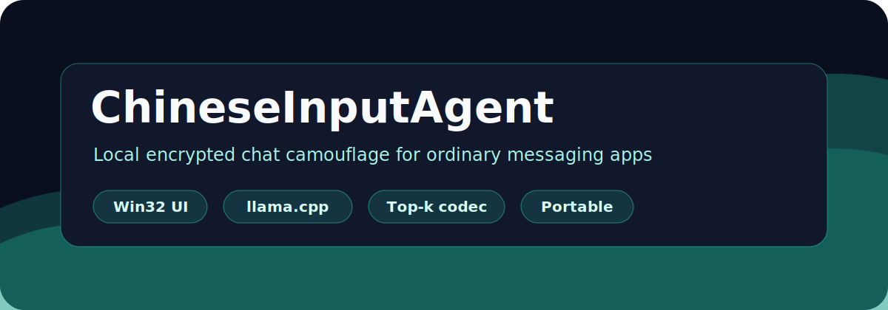

<p align="center">
  
</p>

<p align="center">
  <a href="https://github.com/machinemadefibre-bot/Chinese-Input-Agent"></a>
  
  
  
  
</p>

<p align="center">
  简体中文 | <a href="README.en.md">English</a>
</p>

<h3 align="center">一个把加密消息写成中文文章的本地 Windows 小工具。</h3>

ChineseInputAgent 是一个实验项目：两台 Windows 电脑不搭服务器，也不接在线 API，只通过已有聊天软件复制文本，能不能交换加密消息。

它不是聊天软件。它更像一层本地“翻译层”：先把明文加密成二进制消息，再用本地 llama.cpp worker 把二进制 payload 藏进一段中文载体文章。对方复制整段文章回来，程序用同一个 tokenizer 恢复 payload，再解密成明文。

当前版本已经能完成密钥交换、加密、解密、聊天记录保存和安装器打包，但仍然是实验项目。加密协议和载体编码没有经过正式安全审计。

## 为什么做这个

我一直很喜欢互联网隐私，也和一些同样喜欢折腾隐私的朋友试过很多加密通信软件。问题是，真正聊天的时候，我们经常会在那些软件上叫不到人：有人没开代理连不上，有人不把它放在后台，有人没开通知。最后我们还是会退回到微信，因为微信几乎一直挂在后台，大家也都一定会看。

有时候甚至会变成这样：我先在微信里提醒对方“我在某个加密软件里发你消息了”，然后对方再切过去看。这个过程本身就有点别扭。于是我开始想，与其再做一个新的聊天软件，为什么不直接利用大家本来就在用的聊天软件，只把消息内容本身变成一段可以复制、可以发送、可以恢复的加密文本？

ChineseInputAgent 就是从这个想法开始的。它不想替代微信、QQ、Telegram 或任何现有平台，而是试着在这些平台之上加一层本地加密和文本载体，让两台电脑通过普通聊天窗口也能交换只有彼此能读懂的内容。

## 为什么不是直接发密文

直接把一段随机密文发出去当然最简单，但它也最突兀：一长串看不出意义的字符很容易把注意力集中到“这里有一段需要解开的东西”上。对我来说，这个项目有意思的地方不只是加密，而是让加密后的内容尽量保留普通文本的外观和使用方式。

现在 AI 生成内容已经很常见了，无论是在聊天窗口、论坛、博客。一段普通中文文章都比一段莫名其妙的编码更符合日常语境。ChineseInputAgent 尝试利用这一点，把密文变成一段看起来像正常文章的载体，让两个人或一组人可以通过已有的渠道交换内容，而不必额外约定“去另一个软件里看消息”。


## 和自然语言隐写研究的关系

ChineseInputAgent 不是首个自然语言隐写算法。RNN-Stega、STEGASURAS、ADG 等研究已经证明，可以用语言模型生成自然文本并在 token 选择中承载比特。

这个项目更接近一个本地化工程实现：先对消息加密，再用本地语言模型把密文 payload 编码进中文载体文章，让用户可以通过现有聊天软件复制发送。相比这些研究型方法，它更重视端到端使用流程、本地运行和中文聊天场景；同时它目前没有形式化的分布安全证明，容量也更保守。

## 当前功能

- 导入/导出联系人密钥包，建立两台电脑之间的联系人关系。
- 把明文加密后写成中文载体文章，对方复制整段文章即可解密。
- 消息生成和解析都在本机完成，使用本地 llama.cpp worker 和 GGUF 模型。
- 支持按联系人保存聊天记录，加密和解密成功时自动记录明文。
- 使用 Windows Hello 保护本机 profile 密钥，关键本地数据保存时尽量避免半写坏文件。
- 安装器会在安装时下载模型；portable 包也可以手动放入模型后离线使用。

## 它是

- 是一个本地的小工具。
- 是一层文本载体。
- 是把二进制密文写成中文文章、再从中文文章恢复密文的实验原型。
- 是一个非常轻量的加密软件。

## 它不是

- 不是正式审计过的端到端安全通信协议。
- 不是完整 Signal Protocol、Double Ratchet，也不是完整 Noise Protocol。
- 不是云服务；消息生成和解析都在本机完成。
- 不是为了绕过法律、平台规则、风控或审查的保证工具。
- 不是另一个聊天客户端；它只生成可复制到现有聊天软件里的文本。

## 使用方式

下载 release 或自行构建后运行：

```text
ChineseInputAgent.exe
```

首次启动会创建本机 profile，并通过 Windows Hello 解锁本地密钥。

两台电脑通信的基本流程：

1. A 打开“导入/导出密钥”，导出密钥文本发给 B。
2. B 导入 A 的密钥文本，并给这个联系人命名。
3. B 再导出回复密钥文本发给 A。
4. A 导入 B 的回复密钥文本，并给这个联系人命名。
5. 之后双方在主窗口顶部选择联系人，输入主题和明文，点击“加密”，把生成的中文文章发给对方。
6. 收到消息后复制整段中文文章，点击“解密”。

“聊天记录”按钮会显示当前联系人下保存的明文记录。记录首行包含时间和发送人：

```text
[2026-05-06 18:30:00] 发送人：我
明文内容
```

解密成功时，发送人会使用实际解密成功的联系人名称。

## 大致流程

```text
明文
  -> UTF-16LE bytes
  -> session message encrypt
  -> top-k token payload
  -> 中文载体文章
  -> 复制到聊天软件
  -> 对方复制回来
  -> tokenizer / top-k decode
  -> session message decrypt
  -> 明文
```

## 消息格式说明

当前普通消息是短 session message：

```text
1 byte  format
8 bytes session_id
4 bytes counter
12 bytes AES-GCM tag
N bytes ciphertext
```

固定开销为 25 bytes，不包含外层中文载体文本开销。

密钥交换通过 contact package 完成。首次包较短；回复包会包含 recipient public key，用于自动路由到已有本地 profile。普通消息不再携带 X25519 public key。

密钥交换文本里的指纹是 8 位 base32，只用于通过可信渠道核对指纹，不是强认证。

## 安全边界

中文文章只是载体，不是安全层。真正保护消息的是本地加密层。

当前 session transport 使用静态身份密钥和一次性握手密钥建立双向链，并对每条消息做链式派生。它能避免普通消息重复使用同一个 message key，并支持有限乱序，但没有实现 Double Ratchet，也不是完整的 Signal/Noise 实现或已经正式审计的强前向安全协议。

如果 state 文件回滚、丢失或损坏，session counter / chain state 可能无法继续通信，需要重新交换密钥包。第三方聊天平台如果改写、摘要、翻译、清洗或截断载体文章，payload 解码可能失败。

## 构建

### 环境

- Windows 10/11
- CMake + Ninja
- MSYS2 UCRT64 MinGW-w64，或 Visual Studio Build Tools
- Python 3
- 可选：CUDA Toolkit 或 Vulkan SDK，用于 llama.cpp GPU 后端

### 拉取源码

```bash
git clone --recursive https://github.com/machinemadefibre-bot/Chinese-Input-Agent.git
cd Chinese-Input-Agent
```

如果已经普通 clone：

```bash
git submodule update --init --recursive
```

### 构建主程序

MinGW：

```bat
build-mingw.bat
```

MSVC：

```bat
build.bat
```

### 打包

```bat
build-llama-worker.bat
package-installer-mingw.bat
```

输出：

```text
dist\ChineseInputAgentInstaller.exe
dist\ChineseInputAgent\
```

安装器会在安装时下载模型。portable zip/offline 场景需要手动把 llama.cpp 兼容的 Qwen GGUF 放到：

```text
models\base_model.gguf
```

## 测试

静态 invariant：

```bat
test.bat
```

A/B 独立安装通信测试：

```bat
test-ab-installs.bat
```

`test-ab-installs.bat` 默认会在仓库的 `build\ab-installs` 下创建 A/B 两个测试安装目录。也可以通过参数或环境变量指定真实 A/B 安装目录：

```bat
test-ab-installs.bat -AInstallDir <A安装目录> -BInstallDir <B安装目录>

set CIA_TEST_A_INSTALL_DIR=<A安装目录>
set CIA_TEST_B_INSTALL_DIR=<B安装目录>
test-ab-installs.bat
```

它会在两个安装目录各自的 `data\ab_exchange_test` 下创建独立测试 state，覆盖密钥交换、一来一回通信、单方向多条消息、乱序、丢包和重启后继续通信。

## 目录结构

```text
src/                         Win32 UI、本地 profile、加密、安装器 stub
tools/payload_watermark/     llama.cpp worker 和 top-k payload codec
tools/packaging/             portable 包和安装器拼接脚本
third_party/curve25519-donna X25519 实现
third_party/llama.cpp        llama.cpp submodule
models/                      本地 GGUF 模型放置目录
```

## 当前限制

- 长消息仍然慢，尤其是 CPU 推理。
- 中文载体文章仍可能有小模型味。
- 载体文本不能被平台改写，否则可能解码失败。
- 加密协议没有正式审计。
- 安装器首次运行需要联网下载模型。

## License

MIT. Third-party components keep their own licenses.
